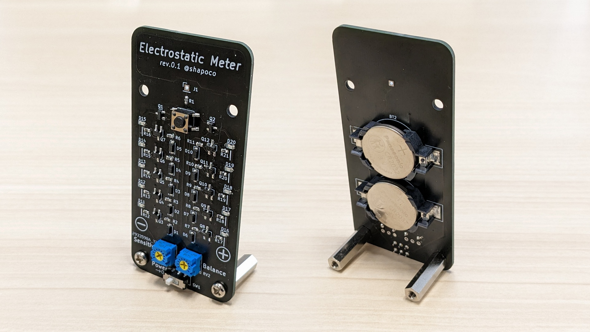
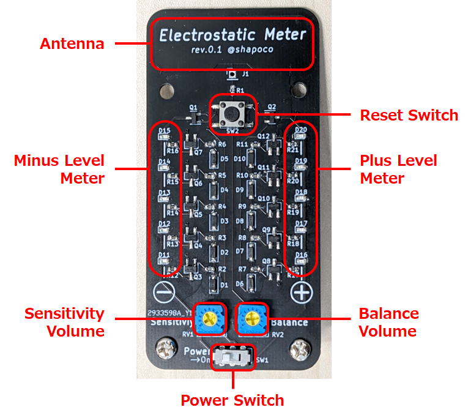
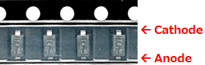
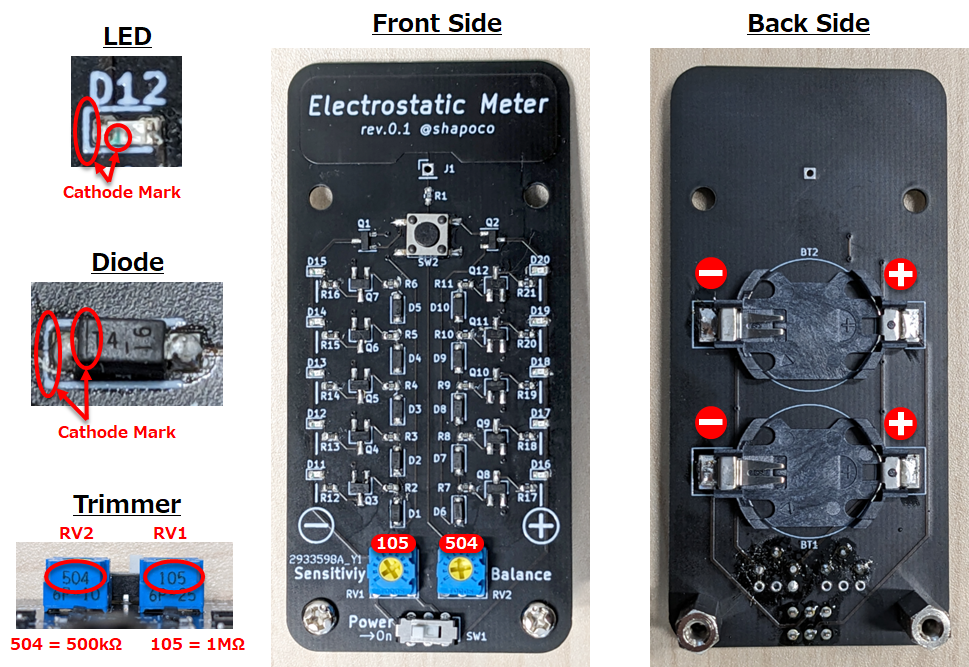

# 簡易静電気メーター

## 概要

簡易静電気メーターは、近づけた物体が帯びている静電気の極性と強さを正負それぞれ5段階のレベルで表示する、簡易式の測定器です。静電気の実験や教育に使用することができます。

## 仕組み

MOS-FETのゲートをオープンにすると静電気に反応する性質を利用しています。

1. アンテナが帯電することで MOS-FET のゲートに電荷が流入し、ドレイン-ソース間に電流が流れます。
2. 直列接続されたダイオードの順方向電圧降下により、帯電のレベルに応じてトランジスタがオンになり、LED が光ります。

## 購入

[BOOTH](https://shapoco.booth.pm/) にて販売予定です。

## rev.0.1 と rev.0.2 の違い

- 感度ボリューム (`RV1`) の回転方向が逆になっています。
- アンテナ部分のシルクの印刷が異なります。
- それ以外はほぼ同じです。

## キット版の組み立て手順

キット版は表面実装部品のはんだ付けが必要です。部品の袋またはテープに記載された部品番号と、基板上のシルク (白い文字) を照らし合わせて、正しい位置にはんだ付けしてください。部品の背の低い順に実装すると作業しやすいと思います。

:warning: MOS-FET、トランジスタ、LED などは、異なる定数のものが混ざると区別がつかなくなりますので、1種類ずつ袋から出して実装してください。

1. 抵抗 (`R1-R21`)
    - 向きの区別はありません。
2. LED (`D11-20`)
    - 見にくいですが、マーキングのある方がカソードです。
3. ダイオード (`D1-10`)
    - テープの穴の開いている側がカソードです。
        - :warning: チップに刻印されている帯は非常に見にくく、一度テープから出すと極性が分からなくなります。テープから直接ピンセットでつまんでください。
            
            

4. MOS-FET (`Q1-2`)
5. トランジスタ (`Q3-Q12`)
6. CR2032ホルダ (裏面)
    - 右側がプラスです。
7. タクトスイッチ (`SW2`)
    - 向きの区別はありません。
8. 半固定抵抗 (`RV1-2`)
    - 部品に105の刻印がある方がRV1、504の刻印がある方がRV2です。
    - 刻印がある面を基板の上側にします。
9. スライドスイッチ (`SW1`)
    - 向きの区別はありません。
10. スペーサー
    - 基板の下部の穴にねじ止めしてください。

表面実装部品のはんだ付けの方法は [こちらのサイト](https://www.kogadenshi.co.jp/%E5%8D%8A%E7%94%B0%E4%BB%98%E3%81%91%E3%83%86%E3%82%AF%E3%83%8B%E3%83%83%E3%82%AF/%E8%A1%A8%E9%9D%A2%E5%AE%9F%E8%A3%85%E9%83%A8%E5%93%81-smd-%E3%81%AE%E5%8D%8A%E7%94%B0%E4%BB%98%E3%81%91/) などが参考になると思います。

## 調整

初めて使う前に調整が必要です。

1. 電源スイッチ (`SW1`) をオンにします。
2. リセットスイッチ (`SW2`) を押したままにします。
3. 感度ボリューム (`RV1`) を回して、レベルを最大にします。
4. バランスボリューム (`RV2`) を回して正負のレベルのバランスを合わせます。
5. 感度ボリューム (`RV1`) を回して、レベルを最小 (両方の LED が 1 つだけ点灯した状態) にします。
6. リセットスイッチ (`SW2`) を離します。

## 使用方法

1. 電源スイッチ (`SW1`) をオンにして使用します。
2. リセットスイッチ (`SW2`) を押してレベルをリセットします。
    - このとき、基板上の部品や配線に手が触れないようにしてください。触れたままだと正しくリセットされないことがあります。
3. アンテナ (基板の上部) に帯電した物体を近づけると、帯電のレベルが LED に表示されます。赤色の LED はプラスの帯電、青色の LED はマイナスの帯電を示します。

## 使用上の注意

- :warning: 帯電した物体をアンテナに直接当てないでください。MOS-FET が壊れる可能性がります。
- :warning: 自分自身の体が帯電しているときは本機に触れないでください。MOS-FET が壊れる可能性がります。
- :warning: 使用しないときは電源を切ってください。LED が電力を消費し続けるため、常設はできません。

## 参考資料

- [回路図 (PDF)](./schematic.pdf)
- [PCBレイアウト](./img/layout.png)

----